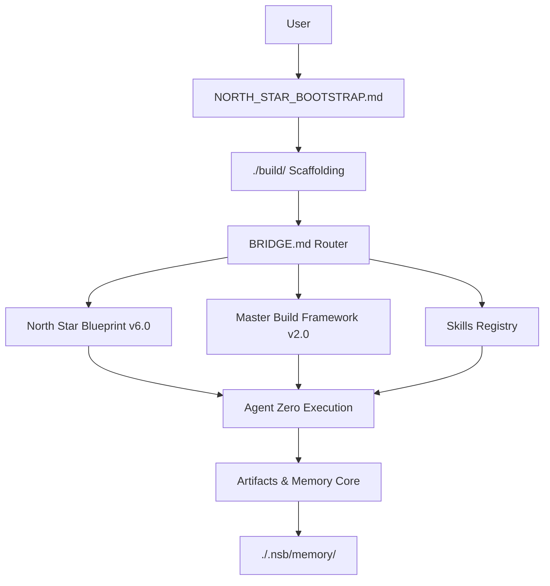

# 🌟 North Star Build 6.0

## The Definitive Framework for AI-Native Software Development

[](https://creativecommons.org/licenses/by-nc-sa/4.0/)
[]()
[]()

---

```
╔══════════════════════════════════════════════════════════════════════════════╗
║                                                                              ║
║                         NORTH STAR BUILD 6.0                                 ║
║                                                                              ║
║              The Compass for Production-Ready AI Development                 ║
║                                                                              ║
║                          ────────────────                                    ║
║                                                                              ║
║                   "Build with intention. Ship with confidence."             ║
║                                                                              ║
╚══════════════════════════════════════════════════════════════════════════════╝
```

---

## 🎯 What is North Star Build?

**North Star Build** is a comprehensive framework ecosystem that transforms how developers and AI agents collaborate to build production-ready software. It provides:

- **📘 North Star Blueprint v6.0** — The *HOW*: 14 parts of battle-tested methodology covering everything from project bootstrap to deployment
- **🔧 Master Build Framework v2.0** — The *WHAT*: 60+ technology categories with curated tool recommendations and integration patterns
- **🌉 BRIDGE.md** — The *WHERE*: Intelligent navigation layer that routes you to exactly what you need

### Why North Star?

| Traditional Approach | North Star Approach |
|---------------------|---------------------|
| Load everything into context | **Load Balancing** — Fetch only what you need |
| Execute until done or fail | **Confidence Calibration** — Pause when uncertain |
| Accumulate state indefinitely | **Self-Cleaning** — Scaffolding removes itself |
| Tool-first, figure out process | **Methodology-First** — Process drives tool selection |

---

## ⚡ Quick Start (2 Minutes)

### For AI Agents (Claude, GPT, etc.)

```markdown
1. Fetch NORTH_STAR_BOOTSTRAP.md (the ignition key)
2. Execute Section 1: Scaffolding Setup Protocol
3. Generate project intelligence file (claude.md)
4. Use BRIDGE.md to navigate to specific sections on-demand
```

### For Human Developers

```markdown
1. Read BRIDGE.md to understand the ecosystem
2. Use NORTH_STAR_BOOTSTRAP.md when starting projects
3. Reference specific NS/MBF sections via BRIDGE routing
4. Install GLOBAL_IDE_RULES.md for cross-project defaults
```

---

## 🏗️ Framework Architecture

```
┌─────────────────────────────────────────────────────────────────────────────┐
│                           NORTH STAR BUILD 6.0                               │
├─────────────────────────────────────────────────────────────────────────────┤
│                                                                              │
│  ┌─────────────────┐                                                        │
│  │   BOOTSTRAP     │ ← Start here (ignition key)                            │
│  │   (75KB)        │                                                        │
│  └────────┬────────┘                                                        │
│           │                                                                  │
│           ▼                                                                  │
│  ┌─────────────────┐                                                        │
│  │    BRIDGE.md    │ ← Navigation layer (routes to what you need)           │
│  │    (41KB)       │                                                        │
│  └────────┬────────┘                                                        │
│           │                                                                  │
│     ┌─────┴─────┐                                                           │
│     ▼           ▼                                                           │
│  ┌──────────┐  ┌──────────┐                                                 │
│  │ BLUEPRINT│  │   MBF    │                                                 │
│  │  (998KB) │  │ (228KB)  │                                                 │
│  │ 14 Parts │  │ 60 Cats  │                                                 │
│  │   HOW    │  │   WHAT   │                                                 │
│  └──────────┘  └──────────┘                                                 │
│                                                                              │
└─────────────────────────────────────────────────────────────────────────────┘
```

---

## 📁 Repository Structure

```
NorthStarBuild_6.0/
├── 📄 README.md                          ← You are here
├── 📄 LICENSE
├── 🌉 BRIDGE.md                          ← Navigation layer
├── ⚙️ GLOBAL_IDE_RULES.md                ← Cross-project IDE rules
├── 🔑 NORTH_STAR_BOOTSTRAP.md            ← Ignition key (v1.3)
│
├── 📘 north-star-blueprint/
│   └── NORTH_STAR_BLUEPRINT_v6.0.md      ← HOW to build (methodology)
│
└── 🔧 master-build-framework/
    └── MASTER_BUILD_FRAMEWORK_v2.0.md    ← WHAT to build with (technology)
```

---

## 🆕 What's New in v6.0

### 🤖 Human-AI Collaboration (Part XIV)
- Autonomy dial settings for agent control
- Confidence calibration to prevent runaway execution
- Thread management and checkpoint patterns
- Efficiency metrics and quality gates

### 🔄 Workflow Orchestration (MBF v2.0)
- **Category 44A**: Kanban & Visual Task Management (HITL patterns)
- **Category 44B**: PromptOps (prompt versioning & management)
- **RLM Patterns**: Reasoning-Loop-Memory for long context management

### 🛡️ Enhanced AI Safety
- Guardrails deep dive (MBF Category 35)
- Confidence-based routing
- Loop prevention mechanisms

---

## 📚 Document Reference

| Document | Purpose | Size | When to Use |
|----------|---------|------|-------------|
| **BRIDGE.md** | Navigation & routing | 41KB | Always — your compass |
| **NORTH_STAR_BOOTSTRAP.md** | Project ignition | 75KB | Starting new projects |
| **GLOBAL_IDE_RULES.md** | Cross-project defaults | 21KB | One-time setup |
| **NORTH_STAR_BLUEPRINT_v6.0.md** | Methodology (14 Parts) | 998KB | On-demand reference |
| **MASTER_BUILD_FRAMEWORK_v2.0.md** | Technology (60 categories) | 228KB | On-demand reference |

---

## 🔗 Raw URLs for AI Agents

```
BRIDGE.md:
https://raw.githubusercontent.com/Navigata1/NorthStarBuild_6.0/main/BRIDGE.md

NORTH_STAR_BOOTSTRAP.md:
https://raw.githubusercontent.com/Navigata1/NorthStarBuild_6.0/main/NORTH_STAR_BOOTSTRAP.md

GLOBAL_IDE_RULES.md:
https://raw.githubusercontent.com/Navigata1/NorthStarBuild_6.0/main/GLOBAL_IDE_RULES.md

NORTH_STAR_BLUEPRINT_v6.0.md:
https://raw.githubusercontent.com/Navigata1/NorthStarBuild_6.0/main/north-star-blueprint/NORTH_STAR_BLUEPRINT_v6.0.md

MASTER_BUILD_FRAMEWORK_v2.0.md:
https://raw.githubusercontent.com/Navigata1/NorthStarBuild_6.0/main/master-build-framework/MASTER_BUILD_FRAMEWORK_v2.0.md
```

---

## 🎯 Key Differentiators

### 1. Load Balancing vs Token Burning
> "Don't consume all framework documents before starting. Fetch what you need, unload when done."

### 2. Confidence Calibration vs Runaway Execution
> "Calibrate confidence thresholds. Pause when uncertain. Ask clarifying questions."

### 3. Self-Cleaning Architecture
> "Scaffolding downloads → builds → removes itself. No permanent bloat."

### 4. Methodology-First vs Tool-First
> "Here's the process, tools plug in. Not: here's a tool, figure out the process."

---

## 🤝 Contributing

We welcome contributions! Please see `CONTRIBUTING.md` for guidelines.

---

## 📜 License

This work is licensed under **Creative Commons Attribution-NonCommercial-ShareAlike 4.0 International**.

- ✅ Share — copy and redistribute
- ✅ Adapt — remix, transform, build upon
- ⚠️ Attribution required
- ⚠️ NonCommercial use only
- ⚠️ ShareAlike — derivatives must use same license

**"North Star Build"** and **"North Star Framework"** are trademarks.

For commercial licensing: Contact repository owner.

---

## 🌟 Star History

If this framework helps you build better software, consider giving it a ⭐!

---

<p align="center">
  <strong>Build something remarkable.</strong><br>
  <em>@NavigatingTruth</em>
</p>


## Architecture Overview



